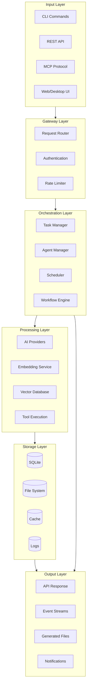
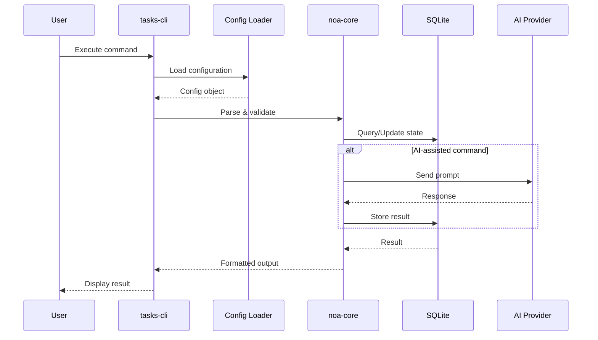
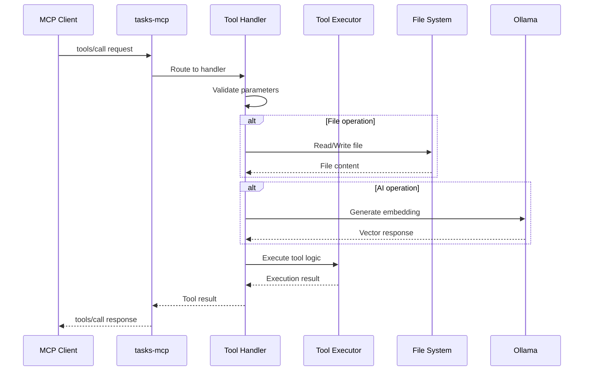
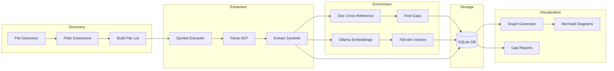
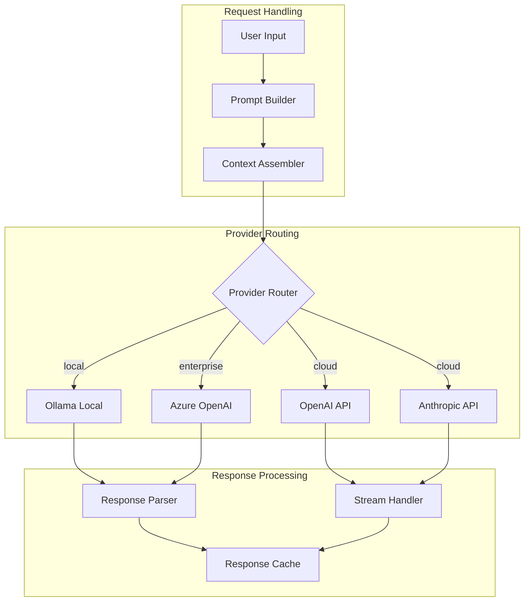
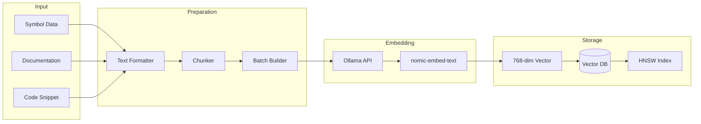
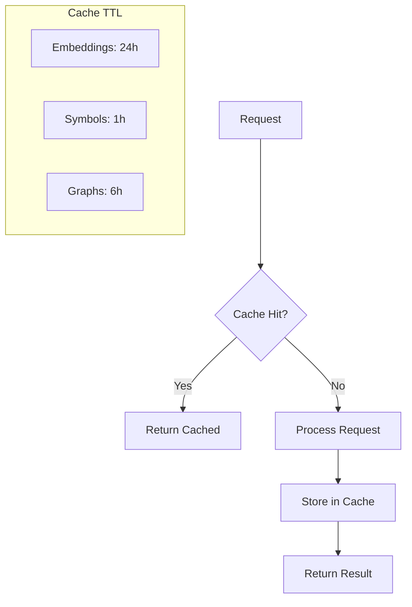
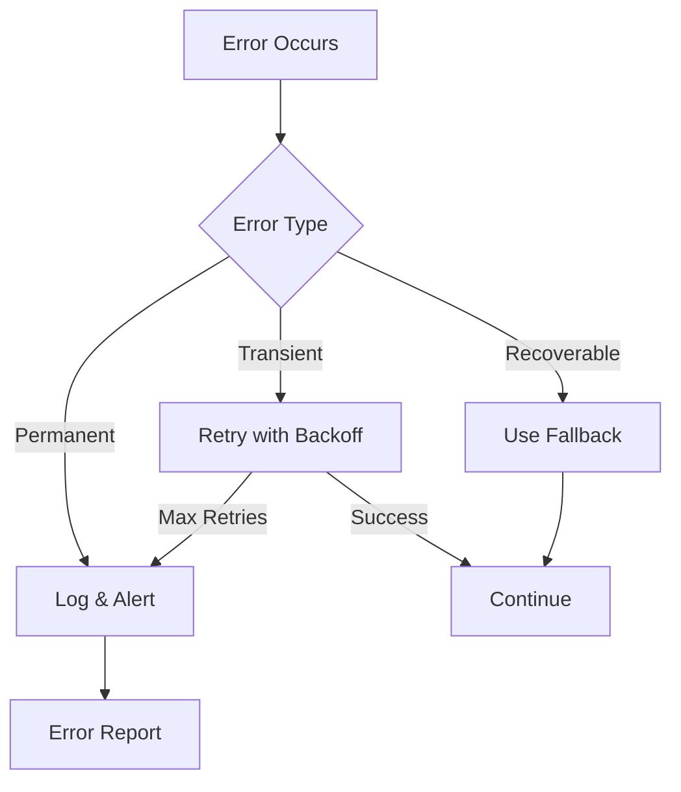

# NOA Platform Data Flow

> Comprehensive data flow documentation for the NOA platform.
> Last updated: 2026-01-01

## Overview

This document describes how data flows through the NOA platform, from user input to system responses, including all intermediate processing stages.

## High-Level Data Flow



## Component Data Flows

### 1. CLI Command Flow



### 2. MCP Tool Execution Flow



### 3. Sweep Pipeline Flow



### 4. AI Provider Flow



### 5. Embedding Generation Flow



## Data Schemas

### Symbol Record

```json
{
  "id": "uuid",
  "name": "function_name",
  "type": "function|struct|trait|module|class|interface",
  "file_path": "relative/path/to/file.rs",
  "line": 42,
  "visibility": "pub|pub(crate)|private",
  "doc_comment": "/// Documentation comment",
  "generics": ["T", "E"],
  "parameters": ["param1: Type1", "param2: Type2"],
  "return_type": "Result<T, E>",
  "embedding": [0.123, -0.456, ...],  // 768 dimensions
  "created_at": "2026-01-01T00:00:00Z",
  "sweep_id": 1
}
```

### Sweep State Record

```json
{
  "id": 1,
  "sweep_number": 1,
  "start_time": "2026-01-01T02:17:10Z",
  "end_time": "2026-01-01T02:45:30Z",
  "status": "completed",
  "files_processed": 92801,
  "symbols_found": 45230,
  "errors": 0,
  "config": {
    "max_parallel": 8,
    "ollama_model": "nomic-embed-text"
  }
}
```

### Documentation Gap Record

```json
{
  "symbol_name": "process_request",
  "symbol_type": "function",
  "file_path": "sys/core/src/handler.rs",
  "line": 156,
  "missing_in": ["wiki", "api_docs"],
  "suggested_docs": ["runbooks/request-handling.md"],
  "priority": "high"
}
```

## State Management

### SQLite Tables

| Table | Purpose | Key Fields |
|-------|---------|------------|
| `sweep_state` | Track sweep iterations | id, sweep_number, status |
| `file_state` | File processing status | file_path, hash, last_sweep |
| `symbols` | Extracted symbols | name, type, file_path, line |
| `embeddings` | Vector embeddings | symbol_id, vector, model |
| `doc_refs` | Documentation references | symbol_id, doc_path, doc_type |
| `graph_edges` | Symbol relationships | from_id, to_id, relationship |

### Cache Strategy



## Integration Points

### External Services

| Service | Protocol | Data Format | Purpose |
|---------|----------|-------------|---------|
| Ollama | HTTP/REST | JSON | Local LLM & embeddings |
| GitHub | REST/GraphQL | JSON | Repository operations |
| VS Code | MCP | JSON-RPC | Editor integration |
| MinIO | S3 | Binary | Object storage |
| Qdrant | gRPC | Protobuf | Vector search |

### Internal APIs

| Component | Port | Protocol | Purpose |
|-----------|------|----------|---------|
| noa-server | 8080 | HTTP | Main API |
| tasks-mcp | 3000 | MCP | Tool server |
| Ollama | 11434 | HTTP | AI inference |
| Qdrant | 6333 | gRPC | Vector DB |

## Error Handling



## Performance Considerations

### Throughput

| Operation | Target | Actual |
|-----------|--------|--------|
| Symbol extraction | 1000 files/sec | ~50 files/sec |
| Embedding generation | 100 vectors/sec | ~10 vectors/sec |
| Graph generation | 5 graphs/min | 5 graphs/min |
| Doc cross-reference | 500 symbols/sec | ~200 symbols/sec |

### Bottlenecks

1. **Embedding Generation**: Limited by Ollama inference speed
2. **File I/O**: Large codebase requires efficient batching
3. **Memory**: Symbol storage grows with codebase size

## Related Documentation

- [Directory Structure](../pages/directory-tree.md)
- [Architecture Diagrams](./diagrams/)
- [API Reference](../api/)
- [Runbooks](../runbooks/)
